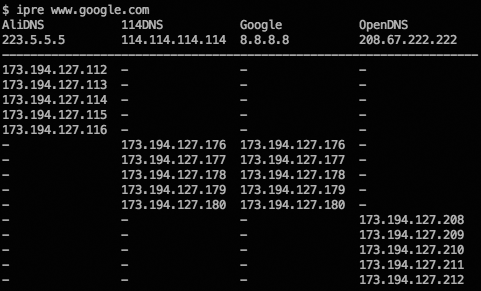

# IP resolver

IP resolver is a command-line tool for getting a domain's IPs from multiple name servers. It can show different query results between different name servers. This tool is implemented in Go.

## Screenshot

## Build

IP resolver relies on *github.com/miekg/dns*, You need to install the package if you don't have that on your machine:

    go get github.com/miekg/dns

Then you can build an executable program using the command below:

    go build ipre.go
    
In Mac or Linux, the executable filename is ipre, in Windows it's ipre.exe.

## How to use

After build the program, you can move the executable file to /bin or ~/bin. Then use the following command to create a configuration file:

    ipre -s > ~/.ipre

This file is JSON formatted. If necessary, modify it to suit your needs. After create the configuration file, you can make a query. For example:

    ipre www.google.com

Type `ipre -h` for more information.

## Example

    ipre www.example.com
    ipre -l config.json -f json -tcp www.example.com
    ipre -l config.json -c
    ipre -s > ~/.ipre && ipre www.example.com

## Download

Click [here](https://github.com/m3ng9i/IP-resolver/releases) to download compiled binaries without compile them yourself.

# 中文说明

IP resolver 是一个使用 Go 语言开发的命令行 IP 查询工具。它可以通过多个 DNS 服务器解析一个域名的 IP 地址，并显示各个 DNS 服务器的查询结果，便于观察不同 DNS 服务器在A记录解析上的不同之处。

## 创建可执行文件

IP resolver 依赖 *github.com/miekg/dns* 包, 如果你没有安装此包，请使用下面的命令安装：

    go get github.com/miekg/dns

然后使用下面的命令创建可执行文件：

    go build ipre.go
    
在 Mac 和 Linux 下，可执行文件名为 ipre ，在 Windows 下为 ipre.exe。

## 如何使用

完成可执行文件的创建后，可以将其移动到 /bin 或 ~/bin 目录，然后运行下面的命令生成配置文件：

    ipre -s > ~/.ipre

配置文件为 JSON 格式，如有需要，可以自行修改。完成配置文件的创建后就可以查询域名的 IP 地址了，举例：

    ipre www.google.com

使用命令 `ipre -h` 显示帮助信息。

## 下载

点[这里](https://github.com/m3ng9i/IP-resolver/releases)下载已编译好的可执行文件，免去自行编译的麻烦。

